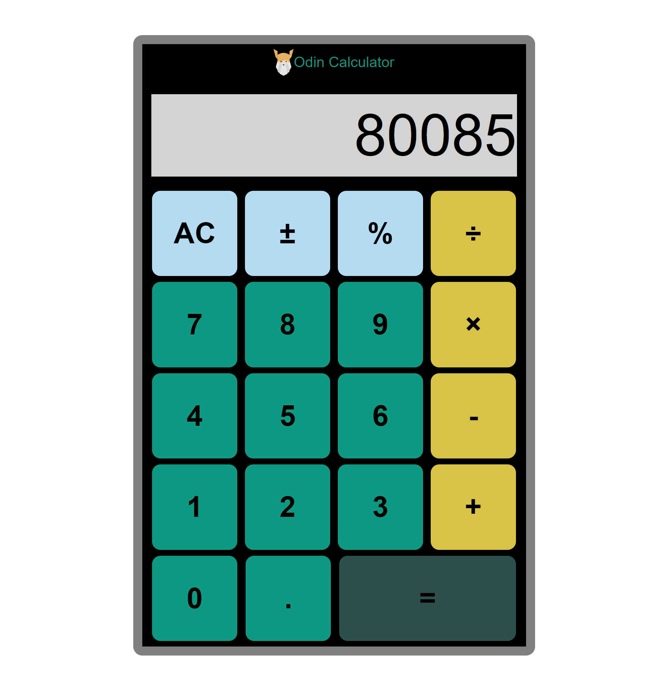
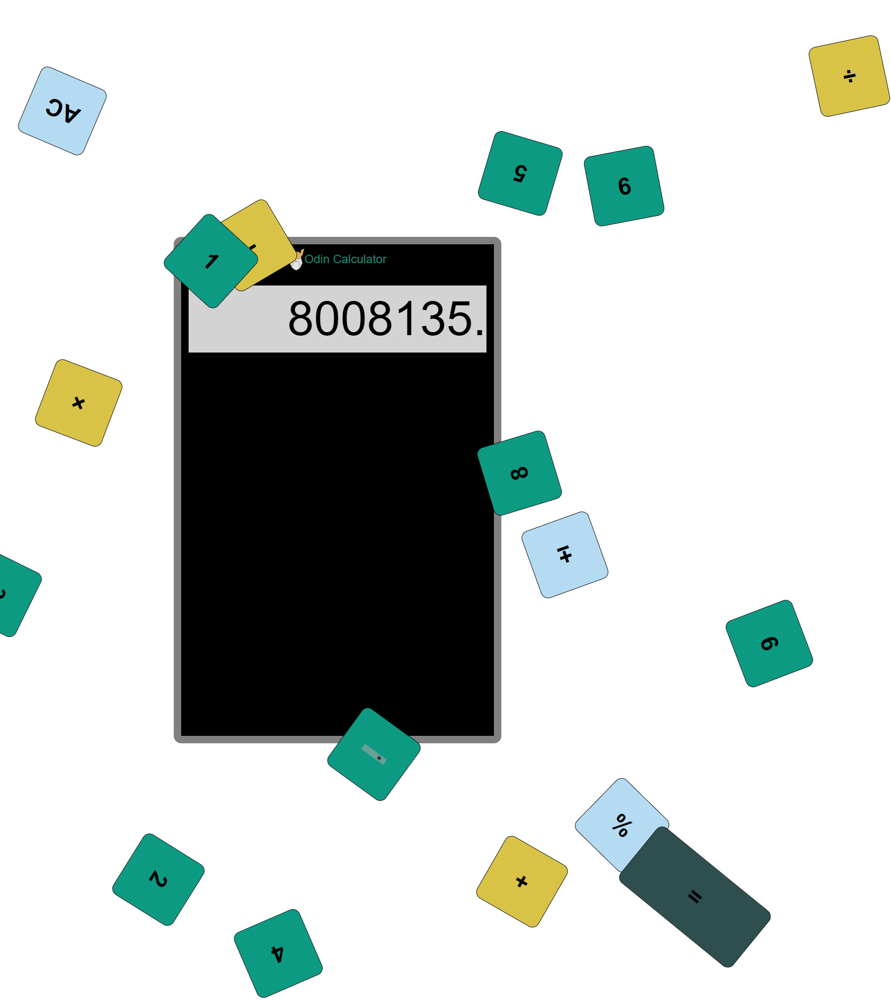

# odin-calculator
Toy calculator using vanilla `Javascript`, `html`, and `CSS`. Live demo [here](#)! It's a cheap calculator, so don't click too fast or it may overheat...

{width=250}

What happens when your calculator overheats!
{width=250}

### Psuedocode
The psuedo roughly goes as follows:
1. If a `number` (0-9) is clicked when there is a number in the stash and a operator is loaded
   1. If this is the first number entry after operator loading, clear the screen
   2. Add the number input to the display bussiness as usual
2. If `=` is clicked (and there is a number in stash and the operator is loaded)
   1. Evaluate the loaded operator with the stashed number and display number
   2. Update the display with the evaluation
   3. Reset the operator null
3. If an `operator` (+,-,/,*,%) is clicked (and there is a number in stash and the operator is loaded)
   1. Evaluate the loaded operator with the stashed number and display number
   2. Update the display with the evaluation
   3. Update the operator function
   4. Update the stashed number with the current evaluation